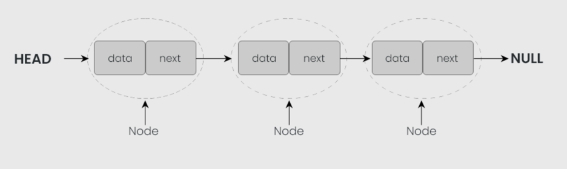
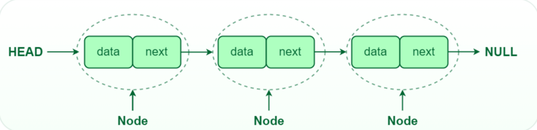
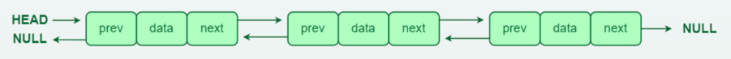
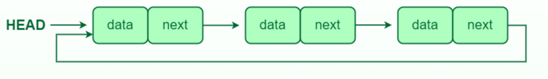

Linked List

A linked list is a linear data structure, in which the elements are not stored at contiguous memory locations. The elements in a linked list are linked using pointers as shown in the below image:

Head and Tail: The linked list is accessed through the head node, which points to the first node in the list. The last node in the list points to NULL or nullptr, indicating the end of the list. This node is known as the tail node.

Types of LinkedList:

**1. Single-linked list:**

In a singly linked list, each node contains a reference to the next node in the sequence. Traversing a singly linked list is done in a forward direction.

**2. Double-linked list:**

In a doubly linked list, each node contains references to both the next and previous nodes. This allows for traversal in both forward and backward directions, but it requires additional memory for the backward reference.

**3. Circular linked list:**

In a circular linked list, the last node points back to the head node, creating a circular structure. It can be either singly or doubly linked.

Standard operations:
1. Insert Node at the beggining
2. Insert Node at the end
3. Insert Node at any position
4. Delete Node
5. Check if Node exist
5. Print

HackerRank:

https://www.hackerrank.com/domains/data-structures?filters%5Bsubdomains%5D%5B%5D=linked-lists

Sources:
https://edwinsiby.medium.com/understanding-linked-lists-in-go-a-comprehensive-guide-for-all-skill-levels-1e3d91a24d08